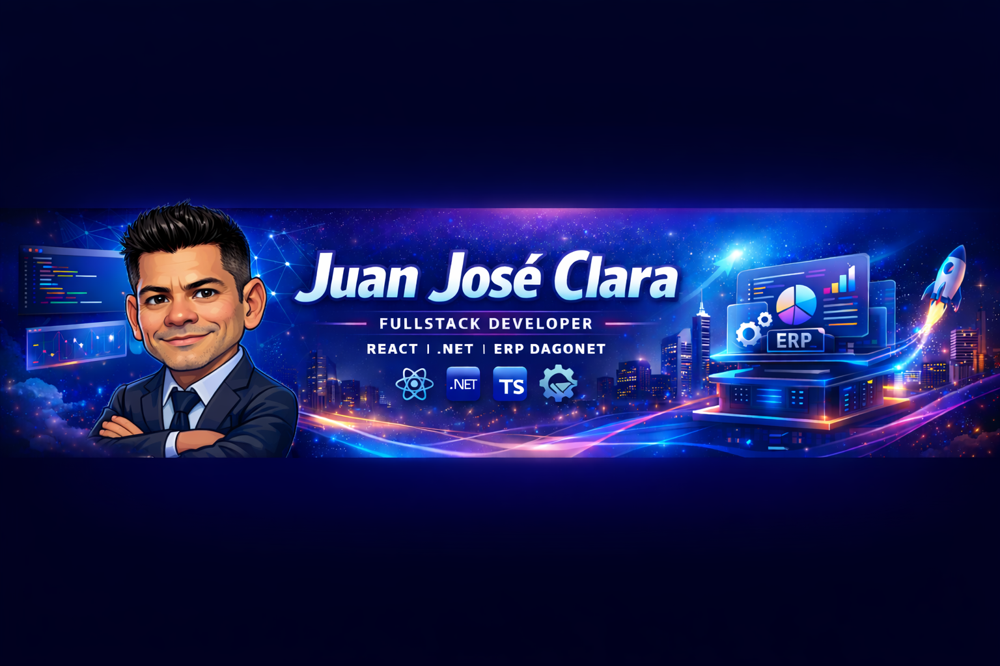

<!-- ===== BANNER ===== -->

  

<!-- ===== TYPING EFFECT ===== -->
<h1 align="center">Juan José Clara</h1>

  

---

## 🚀 Sobre mí

Desarrollador **Fullstack Senior** especializado en construcción de sistemas empresariales robustos y escalables.  
Actualmente enfocado en el desarrollo de **DagoNet ERP**, una plataforma moderna para gestión empresarial multi-empresa.

- 🧠 Enfoque en arquitectura limpia  
- ⚡ Optimización de rendimiento  
- 🏗️ Diseño de sistemas empresariales  
- 🎯 Orientado a resultados de negocio  

---

## 🏢 Experiencia por sector

- 🏦 Banca  
- 📈 Mercado bursátil  
- 🛒 Comercios  
- 🌱 Agricultura  
- 🍽️ Restaurantes  
- 🏛️ Ayuntamientos  

---

## 🛠️ Stack Tecnológico

### Lenguajes

  

- JavaScript / TypeScript  
- C#  
- VB.NET  
- C++  
- Visual Basic clásico  
- VBScript  
- Turbo C  

### Frontend

  

### Backend & DB

  

---

## 📊 GitHub Stats

  

---

## 🐍 Contribution Snake

<picture>
  <source media="(prefers-color-scheme: dark)" srcset="https://raw.githubusercontent.com/jjoseclararivera/jjoseclararivera/output/snake-dark.svg">
  
</picture>

## 🚀 Proyecto Destacado

### 💼 DagoNet ERP

ERP moderno orientado a equipos que necesitan control operativo eficiente.

**Características:**

- ✅ Multi-empresa  
- ✅ Control de roles y permisos  
- ✅ Arquitectura moderna  
- ✅ Alto rendimiento  

---

## 🤝 Habilidades Blandas

- 🗣️ Comunicación efectiva con usuarios  
- 🔗 Alta conexión con equipos de negocio  
- 🎯 Resolución de problemas complejos  
- 🚀 Mentalidad de mejora continua  

---

## 📄 Licencia

Todos los proyectos públicos están bajo licencia **MIT**.

---

  ⭐ Construyendo software que impulsa negocios reales

